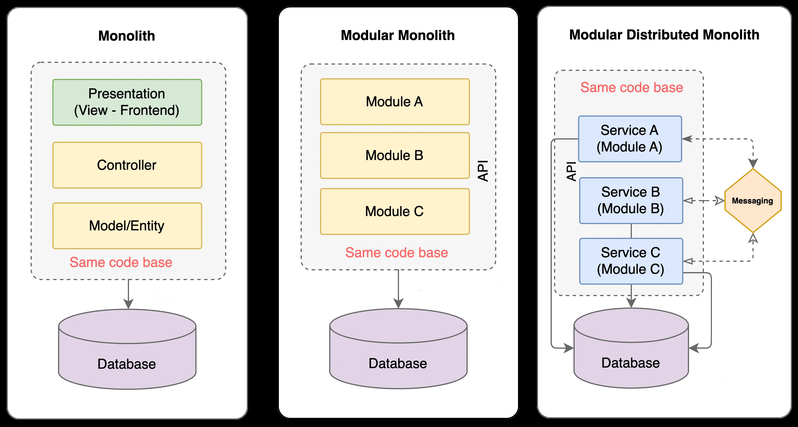

layout: true

.signature[@algogrit]

---

class: center, middle

# Distributed Design Patterns

Gaurav Agarwal

---

# Agenda

- Distributed Systems are an *Engineering Marvel*`*`

.caveat[`*` *when done right*]

---

class: center, middle

Software Engineer & Product Developer

Director of Engineering & Founder @ https://codermana.com

ex-Tarka Labs, ex-BrowserStack, ex-ThoughtWorks

---

## As an instructor

- I promise to

  - make this class as interactive as possible

  - use as many resources as available to keep you engaged

  - ensure everyone's questions are addressed

---

## What I need from you

- Be vocal

  - Let me know if there are any audio/video issues ASAP

  - Feel free to interrupt me and ask me questions

- Be punctual

- Give feedback

- Work on the exercises

- Be *on mute* unless you are speaking

---
class: center, middle

## Class progression

---
class: center, middle

Here you are trying to *learn* something, while here your *brain* is doing you a favor by making sure the learning doesn't stick!

---

### Some tips

- Slow down => stop & think
  - listen for the questions and answer

- Do the exercises
  - not add-ons; not optional

- There are no dumb questions!

- Drink water. Lots of it!

---

### Some tips (continued)

- Take notes
  - Try: *Repetitive Spaced Out Learning*

- Talk about it out loud

- Listen to your brain

- *Experiment!*

---
class: center, middle

### 📚 Content ` > ` 🕒 Time

---
class: center, middle

## Show of hands

*Yay's - in Chat*

---
class: center, middle

## Application Architecture Overview

---
class: center, middle

Let's begin with...

---
class: center, middle

### Monoliths

---
class: center, middle

Monolithic architecture is a traditional software development approach where an application is built as a single, unified unit.

---
class: center, middle

In this architecture, all components of the application, such as the user interface (UI), business logic, and database access, are **tightly** coupled and operate as a single program.

---
class: center, middle

#### What exactly is a monolithic application?

---

Is it an application with a single codebase, deployed as a single service with a database?

---
class: center, middle

or

---

Is it a modular application, deployed as a single service with a single database?

---
class: center, middle

or

---

Is it a multi-services based application using an event-driven architecture and a database?

---

Which of these is **NOT** a monolithic application?

---

Well, **ALL** of them are!

.content-credits[https://tech.tamara.co/monolith-architecture-5f00270f384e]

---
class: center, middle

A single component failure can disrupt the entire application.

---
class: center, middle

With a distributed monolith, the *single component* is the **database**!

---
class: center, middle

They are all sharing the same database instance, with probable tight coupling between the data models.

---

#### Key Characteristics of Monolithic Architecture:

1. **Unified Codebase**

All functionalities are contained within a single codebase and are compiled together into a single executable or deployable unit.

2. **Tight Coupling**

All components are interconnected and interdependent, making it difficult to change one component without affecting others.

3. **Single Deployment Unit**

The entire application is deployed as a single artifact, such as a WAR, JAR, or executable file.

4. **Shared Database**

Typically uses a single, centralized database to manage data for the entire application.

---

#### Advantages of Monolithic Architecture

1. **Simplicity**

Easier to develop, test, and deploy for smaller applications.

2. **Performance**

No inter-service communication overhead since everything runs in a single process.

3. **Straightforward Debugging**

Debugging and logging are simpler because the application runs as a single entity.

4. **Development Tools**

A wide variety of tools and frameworks are available to support monolithic architectures.

---

#### Challenges with Monolithic Architecture

1. **Scalability Challenges**

Difficult to scale individual components since the entire application must scale together.

2. **Reduced Agility**

Harder to adopt new technologies or make changes without risking the entire system.

3. **Slow Deployment**

Even small updates require redeploying the entire application.

4. **Complexity with Size**

As the application grows, the codebase can become large and difficult to manage (the "monolith monster").

5. **Reliability Issues**

A failure in one component can bring down the entire application.

---
class: center, middle

### Microservices

---
class: center, middle

A microservice is an architectural style that structures an application as a collection of small, independent, and **loosely** coupled services.

---
class: center, middle

Each microservice focuses on a specific business capability and operates autonomously.

---
class: center, middle

These services communicate with each other via well-defined APIs, typically using lightweight protocols such as HTTP/REST, gRPC, or messaging systems like Kafka.

---

An **e-commerce platform** can use microservices like:

- **Catalog Service**: Handles product listings.

- **Cart Service**: Manages shopping cart functionality.

- **Payment Service**: Processes payments.

- **User Service**: Manages user profiles.

- **Order Service**: Tracks order processing and history.

---
class: center, middle

Each of these services operates independently but collaborates to provide a seamless user experience.

---
class: center, middle

.image-credits[https://medium.com/design-microservices-architecture-with-patterns/design-e-commerce-applications-with-microservices-architecture-c69e7f8222e7]

---

#### Key Characteristics of Microservices

1. **Single Responsibility**

Each microservice is designed to perform a specific function or business capability (e.g., user management, payment processing).

2. **Independence**

Services can be developed, deployed, and scaled independently without affecting other components of the application.

3. **Decentralized Data Management**

Each microservice often manages its own database, promoting data autonomy and reducing bottlenecks.

4. **Technology Agnostic**

Different microservices can use different programming languages, frameworks, and data storage technologies as per their requirements.

5. **Resilience**

A failure in one service does not necessarily bring down the entire system due to fault-tolerance mechanisms and service isolation.

6. **Continuous Delivery and Deployment**

Enables faster development cycles and easier integration of new features or updates.

---

#### Advantages of Microservices

1. **Scalability**

Individual services can scale independently based on demand.

2. **Flexibility**

Teams can work on different services simultaneously, speeding up development.

3. **Resilience**

Isolated failures reduce the risk of a complete system outage.

4. **Improved Maintainability**

Smaller codebases are easier to understand, test, and maintain.

5. **Technology Diversity**

Allows teams to choose the best tools for each service.

---

#### Challenges with Microservices

1. **Complexity**

Managing many services increases the complexity of the system.

2. **Deployment and Monitoring**

Requires sophisticated tools for orchestration (e.g., Kubernetes) and monitoring.

3. **Inter-Service Communication**

Ensuring reliable and efficient communication is critical.

4. **Data Consistency**

Maintaining consistency across services can be challenging, especially with distributed databases.

---

#### Communication in Microservices

Microservices interact with each other primarily through:

- **Synchronous communication**: Using APIs like REST or gRPC.

- **Asynchronous communication**: Using message brokers like RabbitMQ, Apache Kafka, or Amazon SQS.

---

class: center, middle

Code
https://github.com/AgarwalConsulting/presentation-distributed-design-patterns

Slides
https://distributed-design-patterns.slides.agarwalconsulting.com
