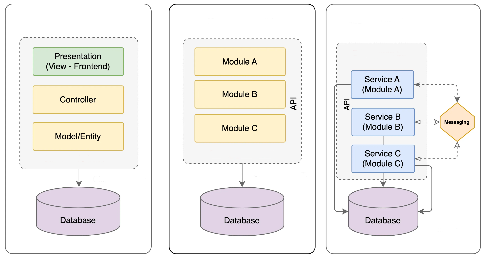
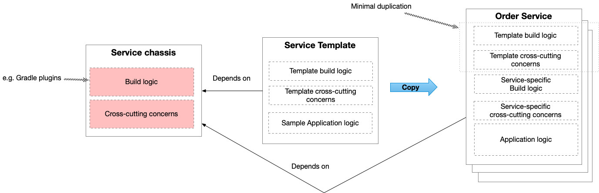
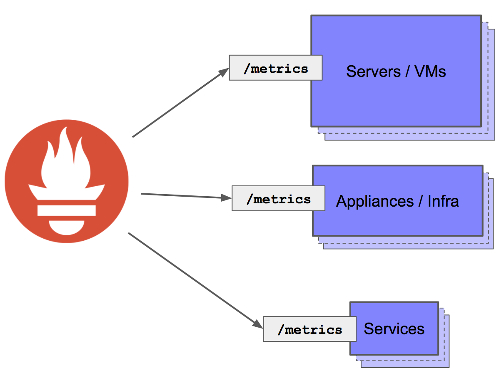

layout: true

.signature[@algogrit]

---

class: center, middle

# Distributed Design Patterns

Gaurav Agarwal

---

# Agenda

- Distributed Systems are an *Engineering Marvel* <sup>`*`</sup>

.caveat[`*` *when done right*]

---

class: center, middle


Software Engineer & Product Developer

Director of Engineering & Founder @ https://codermana.com

ex-Tarka Labs, ex-BrowserStack, ex-ThoughtWorks

---

## As an instructor

- I promise to

  - make this class as interactive as possible

  - use as many resources as available to keep you engaged

  - ensure everyone's questions are addressed

---

## What I need from you

- Be vocal

  - Let me know if there are any audio/video issues ASAP

  - Feel free to interrupt me and ask me questions

- Be punctual

- Give feedback

- Work on the exercises

- Be *on mute* unless you are speaking

---
class: center, middle

## Class progression


---
class: center, middle

Here you are trying to *learn* something, while here your *brain* is doing you a favor by making sure the learning doesn't stick!

---

### Some tips (1/2)

- Slow down => stop & think
  - listen for the questions and answer

- Do the exercises
  - not add-ons; not optional

- There are no dumb questions!

- Drink water. Lots of it!

.caveat[continued...]

---

### Some tips (2/2)

- Take notes
  - Try: *Repetitive Spaced Out Learning*

- Talk about it out loud

- Listen to your brain

- *Experiment!*

.caveat[...continued]

---
class: center, middle

### 📚 Content ` > ` 🕒 Time

---
class: center, middle

## Show of hands

*Yay's - in Chat*

---
class: center, middle

## Application Architecture Overview

---
class: center, middle

Let's begin with...

---
class: center, middle

### Monoliths

---
class: center, middle

Monolithic architecture is a traditional software development approach where an application is built as a single, unified unit.

---
class: center, middle

In this architecture, all components of the application, such as the user interface (UI), business logic, and database access, are **tightly** coupled and operate as a single program.

---
class: center, middle

#### What exactly is a monolithic application?

---

Is it an application with a single codebase, deployed as a single service with a database?


---
class: center, middle

or

---

Is it a modular application, deployed as a single service with a single database?


---
class: center, middle

or

---

Is it a multi-services based application using an event-driven architecture and a database?


---

Which of these is **NOT** a monolithic application?



---

Well, **ALL** of them are!


.content-credits[https://tech.tamara.co/monolith-architecture-5f00270f384e]

---
class: center, middle

A single component failure can disrupt the entire application.

---
class: center, middle

With a distributed monolith, the *single component* is the **database**!

---
class: center, middle

They are all sharing the same database instance, with probable tight coupling between the data models.

---

#### Key Characteristics of Monolithic Architecture

- **Unified Codebase**

  All functionalities are contained within a single codebase and are compiled together into a single executable or deployable unit.

- **Tight Coupling**

  All components are interconnected and interdependent, making it difficult to change one component without affecting others.

- **Single Deployment Unit**

  The entire application is deployed as a single artifact, such as a WAR, JAR, or executable file.

- **Shared Database**

  Typically uses a single, centralized database to manage data for the entire application.

---

#### Advantages of Monolithic Architecture

- **Simplicity**

  Easier to develop, test, and deploy for smaller applications.

- **Performance**

  No inter-service communication overhead since everything runs in a single process.

- **Straightforward Debugging**

  Debugging and logging are simpler because the application runs as a single entity.

- **Development Tools**

  A wide variety of tools and frameworks are available to support monolithic architectures.

---

#### Challenges with Monolithic Architecture

- **Scalability Challenges**

  Difficult to scale individual components since the entire application must scale together.

- **Reduced Agility**

  Harder to adopt new technologies or make changes without risking the entire system.

- **Slow Deployment**

  Even small updates require redeploying the entire application.

- **Complexity with Size**

  As the application grows, the codebase can become large and difficult to manage (the "monolith monster").

- **Reliability Issues**

  A failure in one component can bring down the entire application.

---
class: center, middle

### Microservices

---
class: center, middle

A microservice is an architectural style that structures an application as a collection of small, independent, and **loosely** coupled services.

---
class: center, middle

Each microservice focuses on a specific business capability and operates autonomously.

---
class: center, middle

These services communicate with each other via well-defined APIs, typically using lightweight protocols such as HTTP/REST, gRPC, or messaging systems like Kafka.

---

An **e-commerce platform** can use microservices like:

- **Catalog Service**: Handles product listings.

- **Cart Service**: Manages shopping cart functionality.

- **Payment Service**: Processes payments.

- **User Service**: Manages user profiles.

- **Order Service**: Tracks order processing and history.

---
class: center, middle

Each of these services operates independently but collaborates to provide a seamless user experience.

---
class: center, middle


.image-credits[https://medium.com/design-microservices-architecture-with-patterns/design-e-commerce-applications-with-microservices-architecture-c69e7f8222e7]

---

#### Key Characteristics of Microservices (1/2)

- **Single Responsibility**

  Each microservice is designed to perform a specific function or business capability (e.g., user management, payment processing).

- **Independence**

  Services can be developed, deployed, and scaled independently without affecting other components of the application.

- **Decentralized Data Management**

  Each microservice often manages its own database, promoting data autonomy and reducing bottlenecks.

.caveat[continued...]

---

#### Key Characteristics of Microservices (2/2)

- **Technology Agnostic**

  Different microservices can use different programming languages, frameworks, and data storage technologies as per their requirements.

- **Resilience**

  A failure in one service does not necessarily bring down the entire system due to fault-tolerance mechanisms and service isolation.

- **Continuous Delivery and Deployment**

  Enables faster development cycles and easier integration of new features or updates.

.caveat[...continued]

---

#### Advantages of Microservices

- **Scalability**

  Individual services can scale independently based on demand.

- **Flexibility**

  Teams can work on different services simultaneously, speeding up development.

- **Resilience**

  Isolated failures reduce the risk of a complete system outage.

- **Improved Maintainability**

  Smaller codebases are easier to understand, test, and maintain.

- **Technology Diversity**

  Allows teams to choose the best tools for each service.

---

#### Challenges with Microservices

- **Complexity**

  Managing many services increases the complexity of the system.

- **Deployment and Monitoring**

  Requires sophisticated tools for orchestration (e.g., Kubernetes) and monitoring.

- **Inter-Service Communication**

  Ensuring reliable and efficient communication is critical.

- **Data Consistency**

  Maintaining consistency across services can be challenging, especially with distributed databases.

---
class: center, middle

### Client/Server Application

---
class: center, middle

A client/server application is a distributed system where the application is divided into two main components: the client and the server.

---
class: center, middle

The client initiates requests, and the server processes those requests and provides responses.

---
class: center, middle

This model separates the user interface and user interactions (client-side) from the data storage and processing (server-side), making it a fundamental architecture for many modern applications.

---
class: center, middle

Generally, implemented over the internet (or intranet)

---
class: center, middle

#### OSI Layers - Quick Refresher


.image-credits[https://www.bmc.com/blogs/osi-model-7-layers/]

---
class: center, middle

### SOA

---
class: center, middle

Service-Oriented Architecture (SOA) is an architectural style where an application is composed of loosely coupled, reusable services that communicate over a network.

---
class: center, middle

Each service is designed to perform a specific business function and is accessible through a standard interface, making it easy to integrate services from different platforms, technologies, or organizations.

---
class: center, middle

## Communication

---

Microservices/SOA interact with each other primarily through:

- **Synchronous communication**: Using APIs like SOAP, REST or gRPC.

- **Asynchronous communication**: Using message brokers like RabbitMQ, Apache Kafka, or Amazon SQS.

---
class: center, middle

### SOAP

---
class: center, middle

SOAP (Simple Object Access Protocol) is a protocol for exchanging structured information between systems over a network.

---
class: center, middle

It is a widely used messaging protocol in Service-Oriented Architectures (SOA) and enables communication between applications, regardless of platform or programming language.

---

#### Key Features of SOAP

- **XML-Based**

  SOAP messages are encoded in XML, making them human-readable and platform-independent.

- **Protocol-Agnostic**

  SOAP can use various protocols for communication, including HTTP, HTTPS, SMTP, and more.

- **Standards-Based**

  It is defined by the **W3C** and follows strict standards for message formatting and communication.

- **Extensibility**

  Supports additional functionalities through headers, such as security, transactions, and routing.

- **Error Handling**

  Provides a structured way to return error information via fault messages.

---
class: center, middle

#### Structure of a SOAP Message

---

A SOAP message is composed of the following elements:

- **Envelope**

  - The root element that defines the message structure and namespaces.
  - Example:

    ```xml
    <soap:Envelope xmlns:soap="http://schemas.xmlsoap.org/soap/envelope/">
      ...
    </soap:Envelope>
    ```

- **Header** (Optional)

  - Contains metadata, such as authentication information or transaction context.
  - Example:

    ```xml
    <soap:Header>
      <authToken>ABC123</authToken>
    </soap:Header>
    ```

---

- **Body**

  - Contains the actual message or data being exchanged.
  - Example:

    ```xml
    <soap:Body>
      <getUserDetails>
        <userId>123</userId>
      </getUserDetails>
    </soap:Body>
    ```

- **Fault** (Optional)

  - A sub-element of the body used to return error details if something goes wrong.
  - Example:

    ```xml
    <soap:Fault>
      <faultcode>Client</faultcode>
      <faultstring>Invalid user ID</faultstring>
    </soap:Fault>
    ```

---

#### Example of a SOAP Request

A SOAP request to fetch user details might look like this:

```xml
<soap:Envelope xmlns:soap="http://schemas.xmlsoap.org/soap/envelope/">
  <soap:Body>
    <getUserDetails xmlns="http://example.com/user">
      <userId>123</userId>
    </getUserDetails>
  </soap:Body>
</soap:Envelope>
```

---

#### Example of a SOAP Response

The server might respond with:

```xml
<soap:Envelope xmlns:soap="http://schemas.xmlsoap.org/soap/envelope/">
  <soap:Body>
    <getUserDetailsResponse xmlns="http://example.com/user">
      <user>
        <id>123</id>
        <name>John Doe</name>
        <email>john.doe@example.com</email>
      </user>
    </getUserDetailsResponse>
  </soap:Body>
</soap:Envelope>
```

---

#### Advantages of SOAP

- **Platform and Language Agnostic**

  Works with any platform and programming language.

- **Extensive Standards**

  Comprehensive standards for security (e.g., WS-Security), transactions, and reliability.

- **Support for Complex Operations**

  Handles complex operations like distributed transactions and stateful interactions.

- **Error Handling**

  Well-defined fault messages for robust error reporting.

---

#### Disadvantages of SOAP

- **Verbosity**

  SOAP messages can be large due to XML formatting, leading to increased network usage.

- **Complexity**

  The strict standards and extensive features make SOAP more complex than other protocols like REST.

- **Performance**

  Parsing XML can be slower compared to other lightweight formats like JSON.

---
class: center, middle

### ReST

**Re**presentational **S**tate **T**ransfer

---
class: center, middle

ReST is an architectural style for designing networked applications.

---
class: center, middle

It uses standard HTTP methods to interact with resources identified by URLs, and it emphasizes simplicity, scalability, and stateless communication.

---

#### HTTP Methods in REST

| **Method**   | **Description**                              | **Example**               |
|--------------|----------------------------------------------|---------------------------|
| **GET**      | Retrieve a list of resources                 | `GET /users`              |
| **GET**      | Retrieve a resource-based                    | `GET /users/123`          |
| **POST**     | Create a new resource                        | `POST /users`             |
| **PUT**      | Update an existing resource or create it     | `PUT /users/123`          |
| **PATCH**    | Partially update a resource                  | `PATCH /users/123`        |
| **DELETE**   | Delete a resource                            | `DELETE /users/123`       |

---

#### Example Request to Retrieve a User

**GET** `https://api.example.com/users/123`

**Response**:
```json
{
  "id": 123,
  "name": "John Doe",
  "email": "john.doe@example.com"
}
```

---

#### Example Request to Create a New User

**POST** `https://api.example.com/users`

**Request Body**:

```json
{
  "name": "Jane Smith",
  "email": "jane.smith@example.com"
}
```

**Response**:

```json
{
  "id": 124,
  "name": "Jane Smith",
  "email": "jane.smith@example.com"
}
```

---

#### Key Principles of REST (1/2)

- **Client-Server Architecture**

  Separation of concerns between the client (user interface) and the server (data storage and processing).

- **Statelessness**

  Each request from a client to a server must contain all the information the server needs to process it. No client context is stored on the server between requests.

- **Cacheability**

  Responses should indicate whether they are cacheable to improve performance and scalability.

---

#### Key Principles of REST (2/2)

- **Uniform Interface**

  REST APIs should follow standard conventions, making them easy to understand and use. Key components include:

  - **Resources**: Identified by URIs.
  - **HTTP Methods**: Standard operations like GET, POST, PUT, DELETE.
  - **Representation**: Data can be represented in formats like JSON, XML, or HTML.

- **Layered System**

  A RESTful system can be designed with layers (e.g., load balancers, caching systems) without affecting the client-server communication.

- **Code on Demand (Optional)**

  Servers can provide executable code to clients, such as JavaScript, to extend functionality dynamically.

---

#### Advantages of REST

- **Simplicity**

  Relies on standard HTTP methods and URIs, making it straightforward to understand and implement.

- **Scalability**

  Stateless communication and caching improve scalability.

- **Flexibility**

  Supports multiple formats (JSON, XML, etc.), making it versatile for various use cases.

- **Interoperability**

  Works across different platforms and languages using standard web protocols.

- **Performance**

  Caching mechanisms and lightweight formats like JSON ensure efficient communication.

---

#### Disadvantages of REST

- **Stateless Nature**

  Statelessness can lead to redundant data being sent in each request, impacting performance.

- **Overhead**

  Using HTTP headers and status codes can add some complexity compared to simpler communication models.

- **Limited for Complex Operations**

  May require workarounds for scenarios like long-running transactions or real-time communication.

---

### REST vs SOAP

| **Aspect**              | **REST**                           | **SOAP**                            |
|-------------------------|------------------------------------|-------------------------------------|
| **Protocol**            | Architectural style (HTTP-based)   | Strict protocol (XML-based)         |
| **Data Format**         | JSON, XML, or others               | Only XML                            |
| **Ease of Use**         | Lightweight and simple             | Verbose and complex                 |
| **State**               | Stateless                          | Stateful or stateless               |
| **Security**            | Relies on HTTPS and OAuth          | Built-in standards like WS-Security |
| **Flexibility**         | Highly flexible                    | Rigid standards                     |

REST is ideal for modern web and mobile applications where simplicity and scalability are key.

---
class: center, middle

### gRPC

---
class: center, middle

#### Why gRPC?

---
class: center, middle

Is it Protobuf?

---
class: center, middle

gRPC uses Protobuf for serialization

---

Protobuf offers:

- smaller payloads

- faster serialization/deserialization

compared to text-based formats like `JSON` or `XML`.

---
class: center, middle

But, you can use protobuf with ReST too!

---
class: center, middle

So, why gRPC!?

---
class: center, middle

Let's look at TCP vs UDP...

---
class: center, middle


---
class: center, middle

Every TCP new TCP connection requires a new handshake!

---
class: center, middle

gRPC avoids this by using **HTTP 2**!

---
class: center, middle


---

#### Key Features of gRPC (1/2)

- **Efficient Communication**

  gRPC uses Protobuf for serialization, which is smaller and faster compared to text-based formats like JSON or XML.

- **Cross-Language Support**

  Supports many programming languages (e.g., C++, Java, Python, Go, etc.), allowing seamless communication in heterogeneous environments.

- **Streaming**

  Supports real-time communication through streaming:

  - **Unary RPC**: One request and one response.

  - **Server Streaming**: One request and multiple responses.

  - **Client Streaming**: Multiple requests and one response.

  - **Bidirectional Streaming**: Multiple requests and responses in real-time.

---

#### Key Features of gRPC (2/2)

- **Multiplexing**

  Built on **HTTP/2**, gRPC enables multiplexing of multiple requests over a single connection.

- **Built-in Code Generation**

  Protobuf definitions generate client and server code automatically, reducing boilerplate and ensuring consistency.

- **Strong Typing**

  Protobuf enforces strong typing, catching errors early during development.

---

#### Architecture of gRPC

- **Client**

  - Makes calls to the server using generated client stubs.

  - Stubs are auto-generated from Protobuf definitions.

- **Server**

  Implements the service as defined in the Protobuf file and handles incoming RPCs.

- **Protocol Buffers (Protobuf)**

  Defines the data structures and services in a `.proto` file.

- **Transport Layer**

  Uses HTTP/2 for communication, offering features like compression, multiplexing, and low latency.

---

#### Protobuf Definition (`service.proto`)

```proto
syntax = "proto3";

service UserService {
  rpc GetUser (UserRequest) returns (UserResponse);
}

message UserRequest {
  int32 user_id = 1;
}

message UserResponse {
  int32 user_id = 1;
  string name = 2;
  string email = 3;
}
```

---

#### Advantages of gRPC

- **High Performance**

  Efficient serialization (Protobuf) and HTTP/2 reduce overhead, making gRPC faster than REST for many use cases.

- **Streaming Support**

  Real-time data transmission for use cases like chat applications or live monitoring.

- **Language Interoperability**

  Provides consistent communication across multiple programming languages.

- **Auto-Generated Code**

  Reduces manual effort and potential errors.

- **Scalability**

  Well-suited for microservices and large-scale systems.

---

#### Disadvantages of gRPC

- **Steep Learning Curve**

  Requires familiarity with Protobuf and the gRPC framework.

- **Limited Browser Support**

  Native gRPC does not work in browsers due to HTTP/2 limitations, requiring additional tools like gRPC-Web.

- **Complexity**

  More setup and tooling compared to simpler architectures like REST.

- **Debugging**

  Debugging binary-encoded Protobuf messages can be more challenging than JSON or XML.

---
class: center, middle

### Honorable Mentions: WebSockets, graphQL

---
class: center, middle

### Messaging

---
class: center, middle

Messaging in software architecture refers to the exchange of information between components or systems in the form of messages.

---
class: center, middle

It is a communication mechanism used in distributed systems to enable decoupled interactions between services, applications, or devices.

---

#### Key Concepts in Messaging (1/2)

- **Messages**

  The unit of communication that carries data between components.

  - Messages can be structured (e.g., JSON, XML) or binary (e.g., Protocol Buffers).

- **Message Queue**

  A buffer where messages are temporarily stored until the receiving component processes them.

- **Publish-Subscribe Model**

  A messaging pattern where publishers send messages to a topic, and multiple subscribers receive those messages.

---

#### Key Concepts in Messaging (2/2)

- **Point-to-Point Messaging**

  A pattern where a message is sent from a producer to a single consumer via a queue.

- **Event-Driven Architecture**

  Messaging enables systems to respond to events asynchronously, improving scalability and responsiveness.

---

#### Messaging Patterns (1/2)

- **Request-Response**

  A sender sends a request and waits for a specific response.

  - Example: A client requesting data from a server.

- **Fire-and-Forget**

  A sender sends a message and does not expect a response.

  - Example: Logging messages to a monitoring system.

- **Publish-Subscribe**

  Publishers broadcast messages to topics, and subscribers receive messages from those topics.

  - Example: Notifications or real-time chat systems.

---

#### Messaging Patterns (2/2)

- **Message Routing**

  Messages are directed to specific recipients based on rules or headers.

  - Example: Filtering messages in an email system.

- **Broadcasting**

  Messages are sent to all connected consumers.

  - Example: Live sports updates.

---
class: center, middle

#### Messaging Middleware

Messaging middleware, also known as **Message Brokers**, facilitates message exchange between distributed systems.

---

Examples include:

- **RabbitMQ**:

  - Open-source message broker supporting AMQP protocol.

  - Great for task queues and real-time messaging.

- **Apache Kafka**:

  - Distributed event streaming platform.

  - Ideal for high-throughput, real-time event processing.

- **Amazon SQS**:

  - Fully managed queue service by AWS.

  - Asynchronous processing and task decoupling.

- **ActiveMQ**:

  - Open-source message broker with support for multiple protocols.

---

#### Advantages of Messaging

- **Decoupling**

  Components do not need to know about each other; they interact through messages.

- **Asynchronous Communication**

  Improves system responsiveness and scalability.

- **Scalability**

  Components can process messages at their own pace, handling load spikes effectively.

- **Fault Tolerance**

  Messages can be persisted, ensuring delivery even if components are temporarily unavailable.

- **Real-Time Processing**

  Messaging enables real-time systems, such as notifications or event streaming.

---

#### Disadvantages of Messaging

- **Complexity**

  Introducing messaging middleware adds complexity to the system architecture.

- **Latency**

  Asynchronous communication may introduce delays.

- **Message Loss**

  Improper configuration or failure of brokers can lead to message loss.

- **Dependency**

  Messaging systems can become a single point of failure without proper redundancy.

---
class: center, middle

Messaging is the backbone of modern distributed systems, enabling asynchronous and scalable communication between services.

---
class: center, middle

## [Distributed vs Cloud vs Serverless](https://github.com/AgarwalConsulting/distributed-design-patterns-training/blob/master/examples/01-architecture-overview/distributed-vs-cloud-vs-serverless.md)

---
class: center, middle

## `CAP` vs `BASE` vs `PACLEC`

.content-credits[https://medium.com/@ali.gelenler/distributed-system-trade-offs-cap-vs-base-vs-pacelc-1a3bcac04a7b]

---
class: center, middle

### CAP theorem

defines the limitations and trade-offs in a distributed system


---

It suggests that distributed computer systems can only deliver two out of the following three guarantees:

**Consistency**: Every node sees the same data even when concurrent updates occur

**Availability**: All requests receive responses on whether it was a success or a failure

**Partition tolerance**: The system will keep operating even if there is a network partition in communication between different nodes

---
class: center, middle

In the case of a network partition, the CAP theorem forces a trade-off between *Consistency* and *Availability*.

---

A system must either:

- Maintain consistency, but sacrifice availability (not all requests are responded to).

- Maintain availability, but sacrifice consistency (some responses may be outdated).

---
class: center, middle

### BASE

is an acronym that represents an alternative to strict `ACID` properties


---
class: center, middle

ACID properties

(**A**tomicity, **C**onsistency, **I**solation, **D**urability)

---

class: center, middle

It focuses on availability and performance over strong consistency.

---

- Basically Available (BA): The system is guaranteed to be available, but not necessarily consistent.

- Soft State (S): The state of the system may change over time, even without input (because of eventual consistency).

- Eventual Consistency (E): The system will become consistent eventually, once all updates have propagated.

---
class: center, middle

BASE is a practical strategy to design systems that are highly available and partition tolerant, at the cost of immediate consistency.

---
class: center, middle

It is often used in distributed, NoSQL systems, which prioritize scalability and availability.

---
class: center, middle

### PACLEC

is an Extension to the CAP theorem


---
class: center, middle

It acknowledges that network partitions are not the only factor affecting system performance and behavior.

---
class: center, middle

It also considers the trade-offs between latency and consistency during normal operations, which the CAP theorem does not address.

---

- *PAC*: If there is a Partition, you must choose between Availability and Consistency (this is the CAP theorem)

- *ELC*: Else, when the system is running normally (no partition), you must choose between Latency and Consistency

---

In other words:

- If there’s a partition, the system must decide between availability and consistency.

- If there’s no partition, the system must decide between minimizing latency (faster responses) and ensuring strong consistency.

---
class: center, middle

## Application Design for Scalability

---
class: center, middle

### [12 Factor Principles](https://12-factor-apps.slides.algogrit.com/)

---
class: center, middle

### How can a team quickly create and setup a maintainable code base for a production-ready service so they can start developing its business logic?

---
class: center, middle

If each service setup has to go through a complicated programming process, then it will be a huge overhead to develop a large number of microservices just to build them.

---
class: center, middle

Moreover, apart from build logic, you need to handle cross cutting concerns.

---

Cross-cutting concern include:

- Security
- Externalized configuration
- Logging
- Health check
- Metrics
- Distributed tracing

---
class: center, middle

we would like to have a service template that can be applied across the organization

---
class: center, middle

Such a design pattern is called a **microservice chassis**

---
class: center, middle



.image-credits[https://microservices.io/patterns/microservice-chassis.html]

---

#### How Chassis Works

- **Develop the Chassis**

  - Build a shared library, framework, or set of tools that implement the core features.

  - Provide well-defined APIs for accessing these functionalities.

- **Integrate into Microservices**

  - Each microservice includes the chassis as a dependency.

  - Services use the chassis to handle cross-cutting concerns.

- **Enhance and Maintain**

  - The chassis evolves independently of the business logic.

  - New features or improvements in the chassis are propagated across all services using it.

---
class: center, middle

The main benefit of a microservice chassis is that it’s faster and easier to keep the dependencies, build logic and cross-cutting concern logic up to date.

---

##### Challenges with Chassis

- **Complexity in Design**: Creating a robust and extensible chassis can be challenging.

- **Dependency Management**: Updating the chassis in multiple services may require careful versioning and deployment strategies.

- **Overhead**: A poorly designed chassis might add unnecessary complexity or performance overhead.

---
class: center, middle

One issue is that you need a microservice chassis for each programming language/framework that you want to use.

---
class: center, middle

### What about legacy applications?

---
class: center, middle

use Strangler Pattern!

---
class: center, middle


.image-credits[https://martinfowler.com/bliki/StranglerFigApplication.html]

---
class: center, middle

Modernize an application by incrementally developing a new (strangler) application around the legacy application.

---
class: center, middle

In this scenario, the strangler application has a microservice architecture.

---
class: center, middle

#### The Legacy Replacement Treadmill

.content-credits[https://martinfowler.com/articles/patterns-legacy-displacement/]

---

#### Breaking the cycle

- Understand the outcomes you want to achieve

- Decide how to break the problem up into smaller parts

- Successfully deliver the parts

- Change the organization to allow this to happen on an ongoing basis

---
class: center, middle


---

#### Pros of Strangler Pattern

- Provides a way to reduce risk when doing a system transformation.

- Keeps old services in play while refactoring to updated versions.

- Adds uniquely new services while refactoring older services.

---

#### Cons of Strangler Pattern

- Requires a lot of ongoing attention to routing and network management.

- A refactor effort can get stuck in “adapter hell.” Each instance of strangling an old service in favor of a new one will require special logic to accommodate the rerouting from the old service to the new service. When you have dozens, if not hundreds of services in play, this can be a lot of work.

- Requires making sure that you have a rollback plan in play for each refactored instance. Things will go wrong. You need to be able to roll back to the old way of doing things quickly and safely.

---
class: center, middle

## Observability

.content-credits[https://github.com/AgarwalConsulting/Kubernetes-Training/blob/master/notes/observability.md]

---

- Logging provides insight into application-specific messages emitted by processes.

- Metrics provide quantitative information about processes running inside the system, including counters, gauges, and histograms.

- Tracing, aka distributed tracing, provides insight into the full lifecycles, aka traces, of requests to the system, allowing you to pinpoint failures and performance issues.

---
class: center, middle

### Metrics

---
class: center, middle



.image-credits[https://blog.pvincent.io/2017/12/prometheus-blog-series-part-3-exposing-and-collecting-metrics/]

---
class: center, middle

Introspection using `/healthz`

---
class: center, middle

*Eg*: [Liveness](https://kubernetes.io/docs/tasks/configure-pod-container/configure-liveness-readiness-startup-probes/) probes in K8s

---
class: center, middle

#### Prometheus & Grafana

---
class: center, middle


.image-credits[https://logz.io/blog/prometheus-vs-graphite/]

---
class: center, middle

Push vs Pull mechanisms

---
class: center, middle


.image-credits[https://devconnected.com/the-definitive-guide-to-prometheus-in-2019/]

---
class: center, middle

### Distributed Tracing

---
class: center, middle

#### Using [OpenTelemetry](https://opentelemetry.io/)

---
class: center, middle


.image-credits[https://medium.com/opentelemetry/opentelemetry-beyond-getting-started-5ac43cd0fe26]

---

##### Other Popular Tools for Distributed Tracing

- [Jaeger](https://www.jaegertracing.io/docs/1.18/)

- [Zipkin](https://zipkin.io/)

- [Appdash](https://github.com/sourcegraph/appdash)

---
class: center, middle

## Patterns for Concurrent Systems

---

1. Active Object

2. Monitor Object

3. Lock

4. Thread-Specific Storage

5. Scheduler

6. Thread Pool

7. Async Completion Token

8. Lamport Clock

9. Generation Clock

10. Hybrid Clock

11. Reactor

12. Proctor

---
class: center, middle

### 1. Active Object

---
class: center, middle

The **Active Object** pattern aims to decouple method execution from method invocation.

---
class: center, middle

It does this by introducing an intermediary object that maintains a queue of requests to be executed in a separate thread or process.

---
class: center, middle

This pattern is useful when you want to simplify synchronization and concurrency in systems where multiple clients need to invoke methods on a shared object.

---
class: center, middle

It allows clients to make non-blocking method calls, as the results are computed asynchronously.

---

- **Decoupled Execution**: Separates method invocation from execution.

- **Asynchronous Calls**: Clients can invoke methods without blocking.

- **Concurrency Management**: Ensures thread-safe access to shared resources.

- **Request Queue**: Uses a queue to serialize and manage requests.

---

#### Use Cases of Active Object

- GUI systems where UI updates and backend computations run in different threads.

- Asynchronous task processing in distributed systems.

---
class: center, middle

### 2. Monitor Object

---
class: center, middle

The **Monitor Object** pattern is a synchronization construct that encapsulates shared data and operations on the data, ensuring that only one thread accesses the shared data at a time.

---
class: center, middle

This pattern uses mutual exclusion (e.g., a lock or mutex) to prevent race conditions.

---

- **Encapsulation**: Combines data and methods into a single synchronized unit.

- **Mutual Exclusion**: Ensures that only one thread can execute a method at a time.

- **Condition Variables**: Often includes mechanisms to wait for or signal events.

- **Thread-Safe**: Simplifies multi-threaded programming by hiding synchronization details.

---

#### Use Cases of Monitor Object

- Protecting critical sections in multithreaded applications.

- Implementing thread-safe data structures.

---
class: center, middle

### 3. Lock

---
class: center, middle

A **Lock** is a low-level synchronization primitive that provides mutual exclusion for accessing shared resources.

---
class: center, middle

Threads or goroutines acquire a lock before accessing a shared resource and release it afterward.

---
class: center, middle

Locks help prevent race conditions and ensure data consistency.

---

- **Mutual Exclusion**: Ensures that only one thread can access a resource at a time.

- **Blocking/Non-blocking**: Supports both blocking locks (e.g., mutexes) and non-blocking mechanisms (e.g., spinlocks).

- **Granularity**: Can be fine-grained (per resource) or coarse-grained (spanning multiple resources).

- **Deadlock Prevention**: Requires careful design to avoid deadlocks.

---

#### Use Cases of Lock

- Protecting critical sections in concurrent code.

- Managing shared resources such as files, memory, or network connections.

---
class: center, middle

### 4. Thread-Specific Storage

---
class: center, middle

**Thread-Specific Storage** (TSS) is a technique for associating data with the thread or context that is executing a piece of code.

---
class: center, middle

Each thread has its own storage, allowing threads to maintain unique data without interfering with each other.

---

- **Thread Isolation**: Each thread has its own separate data storage.

- **No Interference**: Prevents data corruption in multi-threaded environments.

- **Context Association**: Often tied to a thread context (e.g., transaction IDs, user sessions).

- **Automatic Cleanup**: Some implementations clean up storage when a thread exits.

---

#### Use Cases of Thread-Specific Storage

- Caching frequently accessed data for individual threads.

- Maintaining thread-specific state, such as transaction contexts in database systems.

---
class: center, middle

### 5. Scheduler

---
class: center, middle

A **Scheduler** is responsible for managing the execution of tasks, threads, or processes in a system.

---
class: center, middle

It determines the order of execution and allocates system resources like CPU time.

---
class: center, middle

Scheduling can be static (predefined order) or dynamic (priority-based, round-robin, etc.).

---

- **Task Prioritization**: Supports static or dynamic prioritization of tasks.

- **Resource Allocation**: Allocates CPU, memory, or other resources efficiently.

- **Fairness**: Ensures equitable execution of tasks (e.g., round-robin, fair queuing).

- **Real-Time Support**: Some schedulers guarantee deadlines in real-time systems.

---

#### Use Cases of Scheduler

- Task scheduling in real-time or operating systems.

- Distributing tasks among workers in parallel processing systems.

---
class: center, middle

### 6. Thread Pool

---
class: center, middle

A **Thread Pool** is a collection of pre-initialized worker threads that execute tasks from a queue.

---
class: center, middle

Thread pools reduce the overhead of creating and destroying threads repeatedly, as threads are reused for multiple tasks.

---

- **Resource Reuse**: Reuses threads, reducing the overhead of thread creation and destruction.

- **Task Queue**: Maintains a queue of tasks waiting to be executed.

- **Concurrency Control**: Limits the number of active threads to avoid overwhelming the system.

- **Scalability**: Efficiently handles a large number of tasks.

---

#### Use Cases of Thread Pool

- High-throughput servers like web servers or databases.

- Background job processing systems.

---
class: center, middle

#### Does Go require Thread Pooling?

---
class: center, middle

*Go Scheduler*

.content-credits[https://go-fundamentals.slides.algogrit.com/#3]

---
class: center, middle

### 7. Async Completion Token

---
class: center, middle

The **Async Completion Token** pattern is a way to handle the results of asynchronous operations.

---
class: center, middle

A token (such as a callback, promise, or channel) is returned when an asynchronous operation is initiated.

---
class: center, middle

The token is used later to retrieve the result or notification when the operation completes.

---

- **Non-blocking**: Initiates an asynchronous operation without waiting for it to complete.

- **Result Handling**: Provides a mechanism (e.g., callback, future, channel) to handle results or errors.

- **Concurrency**: Supports multiple overlapping asynchronous operations.

- **Decoupled Workflow**: Separates the initiation of a task from its completion handling.

---

#### Use Cases of Async Completion Token

- Managing asynchronous I/O operations.

- Handling responses from remote services or APIs.

---
class: center, middle

### 8. Lamport Clock

---
class: center, middle

A **Lamport Clock** is a logical clock used in distributed systems to track the order of events.

---
class: center, middle

It assigns a monotonically increasing number to each event, ensuring a consistent ordering without relying on synchronized physical clocks.

---

- **Event Ordering**: Ensures a consistent logical order of events in distributed systems.

- **Monotonicity**: Logical clock values always increase.

- **Causality Tracking**: Helps determine if one event happened before another.

- **Lightweight**: Requires minimal computation and storage.

---

#### Use Cases of Lamport Clock

- Ensuring event ordering in distributed databases or message queues.

- Conflict resolution in distributed version control systems like Git.

---
class: center, middle

### 9. Generation Clock

---
class: center, middle

A **Generation Clock** is a logical clock that tracks "generations" or epochs of changes.

---
class: center, middle

It is often used in systems where changes to data are grouped into identifiable sets, and the clock advances with each new set of changes.

---

- **Epoch-Based**: Tracks changes in terms of generations or epochs.

- **Change Coordination**: Advances only when significant changes occur.

- **Conflict Resolution**: Useful for versioning and identifying outdated data.

- **Compact Representation**: Often represents state with a single counter.

---

#### Use Cases of Generation Clock

- Versioning in storage systems or databases.

- Coordinating updates in cache invalidation mechanisms.

---
class: center, middle

### 10. Hybrid Clock

---
class: center, middle

A **Hybrid Clock** combines the properties of logical clocks (like Lamport clocks) and physical clocks (real-time clocks).

---
class: center, middle

It uses physical time for ordering when possible and falls back to logical increments when clocks are unsynchronized.

---

- **Physical and Logical Time**: Combines real-world timestamps with logical ordering.

- **Causal Consistency**: Ensures events respect causality.

- **Low Latency**: Provides event ordering with minimal delay.

- **Clock Drift Tolerance**: Handles slight inconsistencies in physical clocks.

---

#### Use Cases of Hybrid Clock

- Distributed systems requiring low-latency event ordering.

- Systems that need both causal consistency and approximate real-time ordering.

---
class: center, middle

### 11. Reactor

---
class: center, middle

The **Reactor** pattern is an event-driven architecture commonly used in I/O-bound systems.

---
class: center, middle

It listens for and demultiplexes multiple event sources, dispatching them to appropriate event handlers.

---
class: center, middle

This pattern is especially popular in network servers.

---

- **Event-Driven**: Listens for and handles multiple events asynchronously.

- **Demultiplexing**: Routes events to the appropriate handler.

- **Non-blocking I/O**: Efficiently manages input/output without thread blocking.

- **High Scalability**: Suitable for handling many simultaneous connections or tasks.

---

#### Use Cases of Reactor

- Asynchronous I/O in network servers (e.g., `select` or `epoll` in Unix systems).

- Event-driven GUI frameworks.

---
class: center, middle

### 12. Proctor

---
class: center, middle

The **Proctor** pattern is a management and monitoring pattern often used for health checks or system monitoring.

---
class: center, middle

It encapsulates logic for assessing the health or state of a system component and reporting the results.

---

- **Health Monitoring**: Regularly checks the state or health of a system component.

- **Error Detection**: Identifies failing or degraded components.

- **Automated Remediation**: Can trigger corrective actions based on health checks.

- **Reporting**: Provides insights into system health for administrators or monitoring systems.

---

#### Use Cases of Proctor

- Monitoring system components like databases, APIs, or microservices.

- Implementing health-check endpoints in distributed systems.

---
class: center, middle

## Data Management Patterns within a single service

---

1. Event Sourcing

2. Domain Event

3. Saga

4. Write-Ahead Log

5. Two-Phase Commit

---
class: center, middle

### 1. Event Sourcing

---
class: center, middle

Event Sourcing is a pattern where the state of an application is derived by replaying a sequence of events rather than storing the current state directly.

---
class: center, middle

Instead of persisting the current state of an entity, every change to the state is recorded as an immutable event in an event store.

---
class: center, middle

In Event Sourcing, all changes to an application's state are captured as a sequence of events.

---

#### Benefits of Event Sourcing

- Complete history of changes.

- Ability to reconstruct past states for debugging or auditing.

- Enables temporal queries (e.g., "What was the state on a specific date?").

- Works well with CQRS (Command Query Responsibility Segregation).

---

#### Challenges of Event Sourcing

- Complexity in replaying events to rebuild the state.

- Handling schema changes in events over time.

---
class: center, middle

**Example:** In a banking system, instead of storing the current account balance, events like "Deposit $100" or "Withdraw $50" are stored and replayed to calculate the balance.

---
class: center, middle

### 2. Domain Event

---
class: center, middle

A Domain Event represents something significant that happens in the domain of the system, usually reflecting a business process or rule.

---
class: center, middle

Domain Events are immutable, describing what has happened (not what will happen), and are often used to trigger actions or workflows.

---
class: center, middle

Domain Events represent significant events within a domain that other parts of the system may react to.

---

#### Benefits of Domain Event

- Decouples parts of the system through event-based communication.

- Captures domain knowledge explicitly.

- Supports eventual consistency across bounded contexts.

---

#### Challenges of Domain Event

- Managing event propagation and delivery reliability.

- Ensuring correct sequencing when multiple events are generated.

---
class: center, middle

**Example:** In an e-commerce system, an event like "OrderPlaced" could trigger notifications, inventory updates, or shipping processes.

---
class: center, middle

### 3. Two-Phase Commit (2PC)

---
class: center, middle

Two-Phase Commit (2PC) is a protocol for distributed transactions.

---
class: center, middle

Two-Phase Commit is a distributed transaction protocol ensuring that all participants in a transaction either commit or rollback changes to maintain consistency.

---

#### Phases

1. **Prepare Phase:** The coordinator asks all participants if they can commit. Participants perform preliminary checks and respond with "ready" or "abort."

2. **Commit Phase:** If all participants are ready, the coordinator sends a "commit" message; otherwise, it sends "rollback."

---

#### Benefits of 2PC

- Strong consistency across systems.

---

#### Challenges of 2PC

- Performance bottleneck due to synchronization.

- Risk of blocking resources if participants fail or time out.

---
class: center, middle

**Example:** Transferring money between two banks requires both to either confirm the transfer or cancel it entirely.

---
class: center, middle

### 4. Saga

---
class: center, middle

A Saga is a long-running distributed transaction pattern where a series of local transactions are coordinated by passing messages/events.

---
class: center, middle

Each transaction has a compensating transaction to rollback changes in case of failure.

---

#### Types of Saga

- **Choreography:** Decentralized, with participants reacting to events.

- **Orchestration:** Centralized, with a controller dictating the flow.

---

#### Benefits of Saga

- Better performance than 2PC as it avoids locking resources.

- Scalability due to eventual consistency.

---

#### Challenges of Saga

- Compensating transactions can be complex to implement.

- Handling failure scenarios requires careful design.

---
class: center, middle

**Example:** Booking a trip may involve reserving flights, hotels, and car rentals. If one reservation fails, the other reservations must be canceled.

---
class: center, middle

### 5. Write-Ahead Log (WAL)

---
class: center, middle

Write-Ahead Log is a pattern where changes are first written to a log before being applied to the database.

---
class: center, middle

In a simplified system, a Write-Ahead Log ensures durability by writing changes to a log before committing them to the database.

---
class: center, middle

This ensures that no data is lost in case of a crash.

---
class: center, middle

The log acts as a single source of truth for all updates and can be replayed to recover or reconstruct the state.

---

#### Benefits of WAL

- Guarantees durability (important for ACID properties in databases).

- Simplifies crash recovery.

- Enables replication and fault tolerance.

---

#### Challenges of WAL

- Log can grow large, requiring pruning or compaction.

- Performance overhead due to logging.

---
class: center, middle

**Example:** In relational databases like PostgreSQL, WAL ensures that transactions are recorded and can be replayed after a crash.

---
class: center, middle

## Data Management Patterns across services

---
class: center, middle

### 1. API Composition

---
class: center, middle

A pattern used in microservices architecture where a single API aggregates and composes data or functionality from multiple microservices into a unified response for clients.

---
class: center, middle

Main Intent is to avoid the client making multiple requests to various services, improving efficiency and reducing complexity on the client-side.

---
class: center, middle

A dedicated API gateway or composition service aggregates data from multiple services.

---
class: center, middle

The aggregator may perform synchronous calls to the underlying services or use asynchronous methods (e.g., messaging).

---

#### Challenges with API Composition

- Performance bottlenecks if many dependent services must be called.

- Potential for cascading failures when one service is unavailable.

---

#### Solutions with API Composition

- Caching responses from services.

- Implementing fallback mechanisms.

---
class: center, middle

**Example:** A service that combines data from a product catalog service, a pricing service, and a reviews service to provide a single "product details" API.

---
class: center, middle

### 2. Command Query Responsibility Segregation (CQRS)

---
class: center, middle

A pattern where the responsibility for **writing (commands)** and **reading (queries)** data is separated into different models.

---

#### Command Side (Write Model)

- Responsible for handling updates (create, update, delete).

- Typically uses normalized data structures to ensure data integrity.

#### Query Side (Read Model)

- Optimized for fast data retrieval, often using denormalized or aggregated data.

- Can use different storage technologies than the write model (e.g., relational for writes and NoSQL for reads).

---

#### Benefits of CQRS

- Optimizes the data model for reads and writes separately.

- Improves scalability, especially for read-heavy systems.

---

#### Challenges of CQRS

- Keeping read and write models in sync can be complex.

- Eventual consistency is often required.

---
class: center, middle

**Example:** A write service updates customer orders in a relational database, while a read service uses a NoSQL database optimized for fast querying of aggregated order data.

---
class: center, middle

### 3. Transactional Outbox

---
class: center, middle

A pattern used to ensure consistency between changes to a database and messages sent to a messaging system (e.g., Kafka).

---

#### Why use Transactional Outbox

- Ensures atomicity in scenarios where both a database update and a message/event must succeed.

- Solves issues in distributed systems without requiring distributed transactions.

---

#### How Transactional Outbox  works

- Write to the application database and the outbox table in the same transaction.

- A background worker reads from the outbox and publishes messages to the messaging system (e.g., RabbitMQ or Kafka).

---
class: center, middle

**Challenge**: Requires efficient and reliable background processing to clear the outbox table.

---
class: center, middle

**Example:** In an **order service**, an "order placed" event is written to the outbox when an order is saved. A worker publishes the event to Kafka.

---
class: center, middle

### 4. Orchestration vs. Choreography

---
class: center, middle

#### Orchestration

A centralized service (or orchestrator) coordinates and controls the interactions between microservices.

---

##### Pros of Orchestrating

- Easier to monitor and debug.

- Predictable flow of control.

##### Cons of Orchestrating

- Single point of failure.

- Can become a bottleneck.

---
class: center, middle

**Example**: A workflow engine like Camunda handles the sequence of operations for order fulfillment.

---
class: center, middle

#### Choreography

Each service reacts to events and independently decides the next step, relying on event-driven communication.

---

##### Pros of Choreography

- Loose coupling.

- Scales well in distributed systems.

##### Cons of Choreography

- Harder to trace and debug.

- Requires well-defined events and schemas.

---
class: center, middle

**Example**: An "order placed" event triggers inventory and payment services to act independently.

---
class: center, middle

### 5. Service Registry

---
class: center, middle

A database where microservices register themselves with their network addresses and metadata.

---
class: center, middle

This enables dynamic discovery of services in environments where services frequently change.

---

#### Popular Tools for Service Registry

- **Eureka (Netflix):** Used with Spring Cloud.

- **Consul (HashiCorp):** A versatile registry with key-value storage.

- **Zookeeper (Apache):** Often used for distributed systems.

---

#### Common Features

- Health checks to ensure registered services are functional.

- Load balancing and metadata for enhanced service interactions.

---

**Example:** A registry entry for a **user service**

```
Name: user-service
Address: http://10.0.0.5
Port: 8080
Metadata: {"version": "1.0.1", "env": "prod"}
```

---
class: center, middle

### 6. Service Discovery

---
class: center, middle

The mechanism by which services locate each other dynamically without relying on hardcoded addresses.

---

#### Types of Service Discovery

- **Client-Side Discovery:** The client queries the service registry to find the service (e.g., Netflix Ribbon).

- **Server-Side Discovery:** A load balancer queries the registry and forwards requests to the appropriate service (e.g., AWS ALB with ECS).

---

#### Challenges with Service Discovery

- Ensuring the registry is updated quickly when services go down or change addresses.

- Security concerns (e.g., untrusted services).

---

#### Service Discovery Example

**Eureka** as a service registry, where clients query Eureka for available services.

#### **Code Example (Spring Cloud with Eureka Client):**

```java
@RestController
public class MyController {
    @Autowired
    private RestTemplate restTemplate;

    @RequestMapping("/get-product")
    public String getProductDetails() {
        String serviceUrl = "http://product-service/products/1";
        return restTemplate.getForObject(serviceUrl, String.class);
    }
}
```

The `RestTemplate` uses the service name (`product-service`) to automatically resolve the URL via **Eureka**.

---
class: center, middle

#### How about Service Registry/Discovery in Kubernetes?

---
class: center, middle

### 7. Self Registration

---
class: center, middle

Services register themselves directly into the service registry upon startup and deregister upon shutdown.

---

#### Pros of Self Registration

- Simplifies setup since each service handles its own registration.

#### Cons of Self Registration

- Tight coupling between the service and the registry.

- Registry APIs must be accessible to all services.

---
class: center, middle

**Example:** A microservice updates a Consul registry with its address and health status via an API.

---
class: center, middle

### 8. Circuit Breaker

---
class: center, middle

A pattern designed to prevent cascading failures in distributed systems by monitoring service health and stopping requests to unhealthy services.

---

#### How Circuit Breakers work

- Monitors the failure rate of calls to a service.

- When failures exceed a threshold, the circuit "opens," stopping further calls.

- After a cooldown period, the circuit enters "half-open" state, allowing limited calls to test recovery.

---

#### Phases of Circuit Breaker Pattern

- **Closed:** Requests flow normally.

- **Open:** Requests are blocked due to repeated failures.

- **Half-Open:** Some requests are allowed to check if the service has recovered.

---

#### Benefits of Circuit Breaker

- Prevents cascading failures in a distributed system.

- Improves system resilience.

---
class: center, middle

**Example Tools:** Netflix Hystrix, Resilience4j.

---
class: center, middle

**Example:** If the **inventory service** is slow or unresponsive, the circuit breaker stops calls and returns a fallback response.

---
class: center, middle

### 9. Adapter vs. Sidecar vs. Ambassador

---
class: center, middle

#### Adapter

A service-specific component that adapts legacy systems or external APIs to work with modern applications.

---
class: center, middle

Acts as a translator or bridge.

---
class: center, middle

**Example**: A module that translates REST requests into SOAP for a legacy service.

---
class: center, middle

#### Sidecar

A companion container/process that provides non-business-critical functionality for the main service.

---
class: center, middle

Runs alongside a service to provide auxiliary functionality (e.g., logging, monitoring).

---
class: center, middle

*Use Case of Sidecar:* Added features without modifying the main service.

---
class: center, middle

**Example:** Envoy proxy used for telemetry in Kubernetes.

---

```yaml
# Kubernetes YAML for a sidecar (Envoy)
apiVersion: apps/v1
kind: Deployment
metadata:
  name: my-app
spec:
  replicas: 1
  template:
    spec:
      containers:
        - name: my-app
          image: my-app-image
        - name: envoy
          image: envoyproxy/envoy
          ports:
            - containerPort: 10000
```

---
class: center, middle

#### Ambassador

Specialized sidecar that acts as an external proxy for the service.

---
class: center, middle

A proxy that handles traffic into/out of the service mesh (e.g., API Gateway).

---
class: center, middle

A specialized sidecar that acts as an API gateway or proxy for a service, handling external communication (e.g., routing, authentication).

---
class: center, middle

*Use Case of Ambassador:* Exposing services to the outside world with additional features like TLS termination.

---
class: center, middle

**Example:** Ambassador API Gateway in Kubernetes clusters.

---

```yaml
apiVersion: apps/v1
kind: Deployment
metadata:
  name: ambassador-gateway
spec:
  replicas: 1
  template:
    spec:
      containers:
        - name: ambassador
          image: datawire/ambassador
          ports:
            - containerPort: 8000
```

---
class: center, middle

```text
[Service] -- Adapter (Data Translator)
[Service + Sidecar] -- Sidecar (Logging)
[Ambassador] -- (Ingress Traffic Proxy)
```

---
class: center, middle

Code
https://github.com/AgarwalConsulting/distributed-design-patterns-training

Slides
https://distributed-design-patterns.slides.agarwalconsulting.com
